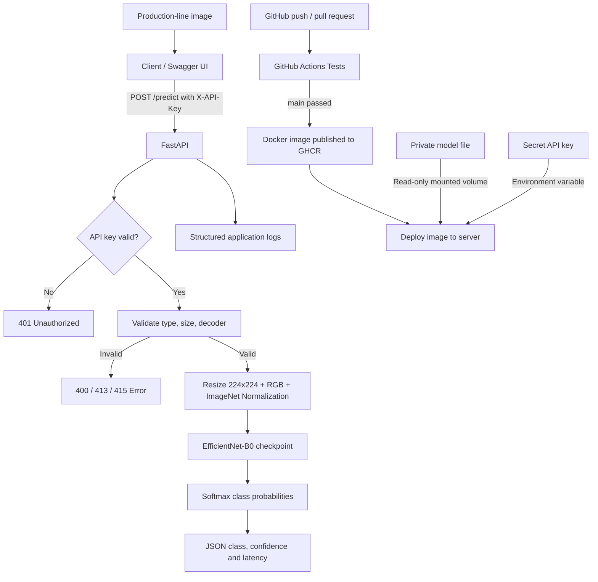

# Architecture

```mermaid
flowchart TD
    A[Production-line image] --> B[Client / Swagger UI]
    B -->|POST /predict with X-API-Key| C[FastAPI]
    C --> D{API key valid?}
    D -->|No| E[401 Unauthorized]
    D -->|Yes| F[Validate type, size, decoder]
    F -->|Invalid| G[400 / 413 / 415 Error]
    F -->|Valid| H[Resize 224x224 + RGB + ImageNet Normalization]
    H --> I[EfficientNet-B0 checkpoint]
    I --> J[Softmax class probabilities]
    J --> K[JSON class, confidence and latency]
    C --> L[Structured application logs]
    M[GitHub push / pull request] --> N[GitHub Actions Tests]
    N -->|main passed| O[Docker image published to GHCR]
    O --> P[Deploy image to server]
    Q[Private model file] -->|Read-only mounted volume| P
    R[Secret API key] -->|Environment variable| P
```
